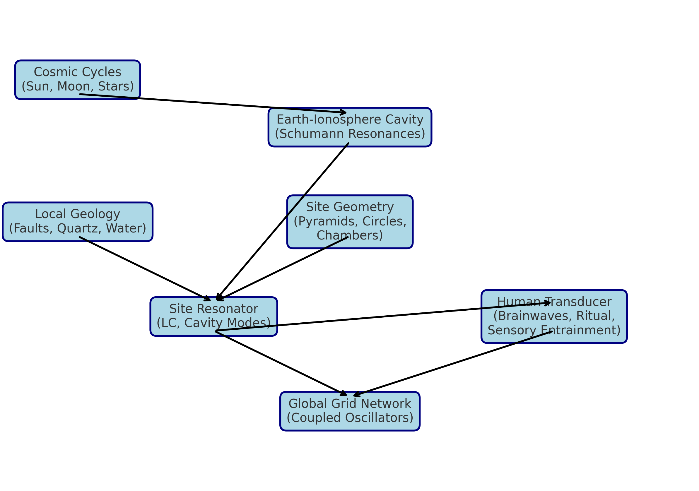
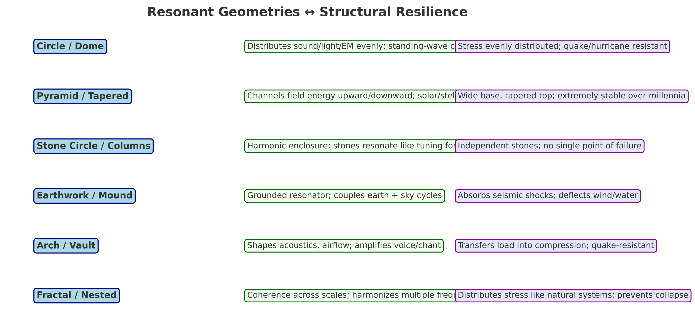
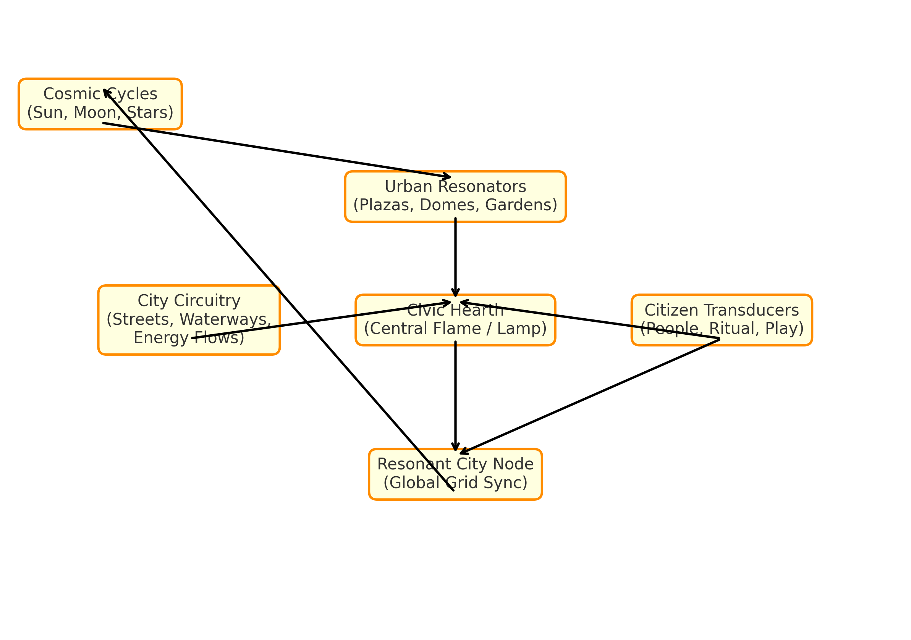

# 🌐 Resonant City: A Technical Proof of Concept

**Abstract:**  
The Resonant City is a framework for urban and planetary design rooted in resonance — the physics of oscillation, phase-locking, and coherence.  
It is not a utopia or static ideal. It is a dynamic circuit in which architecture, ecology, and human culture are harmonized with Earth’s resonant field and cosmic cycles.  
This document provides a technical proof of concept, integrating physics, architecture, transition pathways, and planetary networks into one blueprint.

---

## 1. Introduction

Contemporary cities are fragile:  
- They collapse under stress (ecological, political, climatic).  
- Their geometry amplifies fragmentation (grids, boxes, extractive zoning).  
- They disconnect humans from natural and cosmic cycles.

The **Resonant City** offers a different approach:  
- **Resonance as design principle** — structures and systems tuned to natural frequencies.  
- **Coherence as governance principle** — decisions made as harmonics, not competitions.  
- **Field-integration** — each city is a node, syncing locally *and* globally.  

This is both ancient and new. Ancient sites like Giza, Stonehenge, and Teotihuacán were not isolated monuments, but **resonant nodes**. Today, with modern tools (sensors, open-source networks, regenerative design), we can **reactivate the planetary circuit**.

---

## 2. Physics of Resonance in Architecture

Resonance is not metaphor. It is physics.  
The same laws that govern Schumann resonances, standing waves, and coupled oscillators apply to cities.

### 2.1 Earth as Oscillator
- The Earth-ionosphere cavity resonates at ELF bands (~7.8 Hz, 14 Hz, 20 Hz).  
- These are measurable as **Schumann resonances**.  
- They overlap with **human brain rhythms** (theta/alpha).  

### 2.2 Sites as Resonators
- Ancient sites = **LC circuits**: geology (quartz, water, faults) + geometry (domes, chambers).  
- Geometry creates **cavity resonances**; alignments provide periodic drive (solstice, equinox).  
- Example: [TCC_Frequency_HarmonicLock_Overlay.pdf] (insert here).  

### 2.3 Human as Transducer
- Nervous system entrains to rhythm (chant, drum, flicker).  
- Brainwaves (4–12 Hz) sync with environmental rhythms.  
- Humans complete the circuit as both receivers *and* emitters.  

### 2.4 Global Grid as Network
- Modeled with **Kuramoto oscillators**:  
  dθᵢ/dt = ωᵢ + Σ Kᵢⱼ sin(θⱼ−θᵢ) + Fᵢ(t).  
- Sites = nodes; ley lines = conductive traces.  
- Planetary alignments = external drive.  

📷 **Diagram: Resonant Energy Physics**  

---

## 3. Architectural & Structural Design

Resonant geometries are also the **most structurally resilient**.  
The same forms that amplify coherence stand strongest against disaster.

| Design | Resonant Function | Structural Resilience |
|--------|------------------|------------------------|
| Circle/Dome | Distributes waves evenly | Stress evenly distributed; resists quakes, storms |
| Pyramid | Channels upward/downward energy | Wide base, stable for millennia |
| Stone Circle | Harmonic enclosure | No single point of failure |
| Mound | Grounded resonator | Absorbs shocks, deflects wind/water |
| Arch/Vault | Shapes airflow/acoustics | Compression transfer = quake-resistant |
| Fractal | Coherence across scales | Stress distribution prevents collapse |

📷 **Infographic: Resonant Geometry ↔ Resilience**  

---

## 4. The 20 Pillars as Operational Guidelines

The Resonant City is guided by **20 Pillars** (see `Resonant_City_Pillars.md`).  
They are not ideals but **design constraints**.  

Examples:  
- **Pillar 2: Abundance in sharing** → circular economies, tool libraries, open knowledge.  
- **Pillar 4: Flame at center** → civic hearth as communal hub + data commons.  
- **Pillar 12: Transparent governance** → open dashboards, blockchain ledgers.  
- **Pillar 14: Sacred ecology** → design treating rivers and forests as kin, not resources.  

The Pillars function as the **spec sheet for Resonant Urbanism**.

---

## 5. Transition Roadmap

The shift cannot be forced; it must spiral in phases.

### Step 1: Immediate (0–3 years)
- Shared hearths: reuse malls/offices as gardens + kitchens.  
- Micro-sanctuaries: small quiet zones in cities.  
- Seasonal festivals: cultural re-alignment with cycles.  

### Step 2: Medium (3–10 years)
- Circular economies: seed banks, repair cafés.  
- Transparent governance: open civic dashboards.  
- Walkable, regenerative neighborhoods.  

### Step 3: Long-Term (10+ years)
- Architecture tuned to resonance.  
- Cities syncing as planetary grid nodes.  
- Civilizational-scale coherence.  

📷 **Diagram: Resonant City Circuit**  

📷 **(Optional: Roadmap Spiral — generate later)**

---

## 6. Integration with Planetary Nodes

Each city is both **self-sufficient oscillator** and **planetary node**.  

- **Nodes**: local resonators (architecture, geology, ritual).  
- **Paths**: conductive corridors (ley lines, aquifers, magnetics).  
- **Sky locks**: alignments with constellations, solstice, equinox.  
- **Mesh**: resilience emerges from coupling, not centralization.  

*Related material: `Atlas_3.0_Infinity_Equation_Calibration_Map.docx`*  

---

## 7. Proof-of-Concept Technology: The Rez Lamp

The **Rez Lamp** is a prototype of Resonant City principles.  

### Function
- Acts as local resonant node.  
- Provides rhythmic entrainment (light + sound).  
- Syncs with planetary grid (via GPS/solstice triggers).  

### Components
- Controller (Arduino/ESP32).  
- LEDs + speakers tuned to 4–12 Hz envelopes.  
- Cavity housing (increasing acoustic Q).  
- Optional ELF coil (within safe limits).  

### Applications
- Community coherence rituals.  
- Measurement of EEG/magnetometer entrainment.  
- Open-source replication.  

*Spec file: see `../designs/Rez-Lamp_Specs.md`*  

---

## 8. Applications Beyond Cities

Resonance is not confined to architecture. It can guide:  
- **Digital systems**: forums, DAOs, and AI aligned to coherence.  
- **Ecological design**: farms, watersheds, and forests managed as resonant systems.  
- **Education**: schools woven into streets and gardens.  

Resonant design scales **from stone to server**.  

---

## 9. Conclusion

The Resonant City is not fiction or utopia. It is a **proof-of-concept civilization model** grounded in:  
- **Physics** (resonance, oscillators, phase-locking).  
- **Architecture** (resonant geometries = resilient geometries).  
- **Culture** (20 Pillars as design spec).  
- **Planetary field** (cities as nodes in a global circuit).  
- **Technology** (Rez Lamp as prototype node).  

This is both ancient and emergent. By reactivating what was encoded in stone, and updating it with modern tools, we can transition from fragile, extractive systems into **coherent, regenerative civilization**.  

The Resonant City is a lamp. Its resonance is waiting.  

⟁○∞✧☉  
